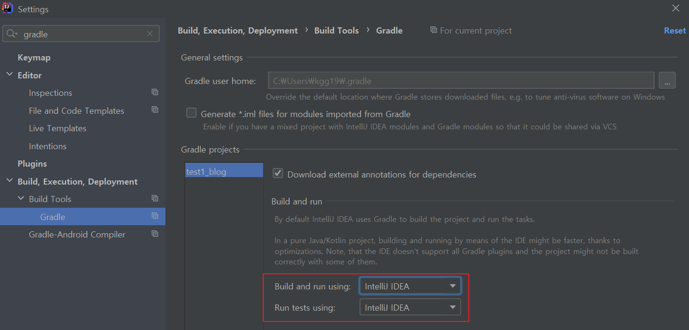

* jpa는 데이터베이스와 객채를 매핑시키는 인터페이스
* spring boot에서


# spring boot 의존성 추가
* build.gradle파일 수정
```
dependencies {
    --생략--	
	implementation 'org.springframework.boot:spring-boot-starter-data-jpa'
    --생략--	
}
```

<br>

* resource/applcation.properties파일 수정
```
spring.jpa.show-sql=true
spring.jpa.hibernate.ddl-auto=none
```

<br>

# 컴파일 설정
* settings -> gradle 검색


<br>


# 참고자료
* 김영한님 유투브 강의: https://youtu.be/pwPxKPWIrX8