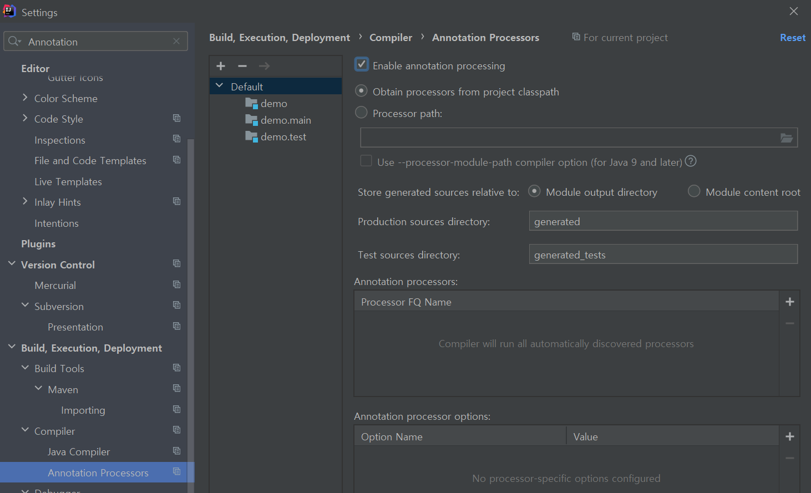

# 의존성 추가
```
dependencies {
    compileOnly 'org.projectlombok:lombok'
    annotationProcessor 'org.projectlombok:lombok'
}
```
<br>

# 어노테이션 설정
* Build -> Annotation Processors -> Enable annotation processing 체크


# NoArgsConstructor 
* 기본 생성자 생성
* AccessLevel=Protected: 외부 생성자 호출을 제한(안전성)
* 참고자료: https://www.popit.kr/%EC%8B%A4%EB%AC%B4%EC%97%90%EC%84%9C-lombok-%EC%82%AC%EC%9A%A9%EB%B2%95/